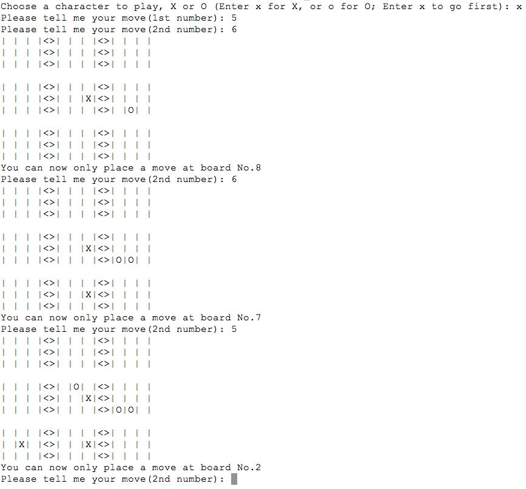

## Game Rule
Rule is refered to [Advanced Tic Tac Toe game rule](https://en.wikipedia.org/wiki/Ultimate_tic-tac-toe)
## Interface
# Location of piece and board
The location of x or o on a single board is labeled as 1 - 9 as the following. In 9-board advanced version, a single board is similarly located as 1 - 9. First input the location of the board you want to place a piece in, then input where you want to place that piece inside that board.
 
# Sample Game Play

